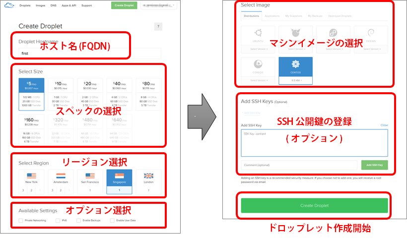

.. -*- coding: utf-8 -*-

=======================================
DigitalOcean 入門ガイド
=======================================

.. sidebar:: 目次

   .. contents:: 
       :depth: 3
       :local:

目的
====================

DigitalOcean ( https://www.digitalocean.com/ ) が提供するサービスに対して、日本語による情報整理が目的です。

DigitalOcean とは
====================

.. * “We’re simplifying the cloud by providing an infrastructure experience that developers love.”　 ( twitter profile `@digitalocean <https://twitter.com/digitalocean/>`_ )"

* 「私達はクラウドを簡素化します。そのために、開発者が好むインフラのユーザ経験を提供します。」  ( twitter profile `@digitalocean <https://twitter.com/digitalocean/>`_ )

.. * "Who is DigitalOcean for? “DigitalOcean is a platform created for developers who need to launch and scale their applications quickly. Additionally, DigitalOcean provides the perfect environment for developers to play around on the command line and learn more about customizing their own servers” ( https://www.digitalocean.com/help/ )"

* 「 DigitalOcean は、アプリケーションを迅速に起動してスケールする必要がある開発者向けに作ったプラットフォームです。さらに、 DigitalOcean が提供するのは、開発者がコマンドライン上から操作でき、自分自身のサーバをカスタマイズする方法を学ぶための完全なる環境です。」 ( `ヘルプ <https://www.digitalocean.com/help/>`_ より)

経緯
----------

* 2011 年設立、クラウドのインフラ事業者を目指す。Ben氏、Moisey Uretsky氏によって創業。
* 開発者を大切にするビジョン。複雑なインフラの管理を簡単にし、利用者に良いユーザ経験をもたらすプロダクトを作る。
* シンプルで直感的なインターフェースと機能、Solid State Drive (SSD)のRAID基盤、豊富な API
* 世界7箇所にデータセンタを開設（アメリカ東西、シンガポール、イギリス、オランダ、ドイツ、カナダ）

特長
----------

* 55秒以内に仮想サーバを起動。使いたいとき、すぐに起動して、使い終わったら廃棄。かつ課金は時間単位 $0.007/時間～（月上限 $5 ～)
* 全ての環境が SSD ( Solid State Drive ) 。低いディスクのレイテンシ（応答速度の遅延）、かつ、CPUはディスクI/Oに使用率を奪われにくい
* シンプルなコントロールパネルと API。直感的に使えるウェブ・インターフェース、豊富な API はブラウザから行える全ての機能をプログラム的に実行

機能
----------

* 仮想サーバ（ドロップレット）管理。仮想サーバの起動・停止・強制再起動・破棄・スペック変更、ブラウザからのコンソール接続、プライベート接続、IPv6 のサポート、Kernel 変更機能、レスキューモード、ホスト名変更、リソースグラフ表示、プロビジョニング
* イメージ管理。スナップショット、それを元にした起動やデータセンタ配布、定期バックアップやバックアップから差し戻し。また、多くの公式イメージを提供( Ubuntu, CentOS, CoreOS, FreeBSD ) + アプリケーション設定済みイメージ。
* DNS管理。ネームサーバのホスティング、GUIを通したゾーン設定、仮想サーバに対する自動逆引き設定。

バックエンド・設備
--------------------

* KVM 仮想化技術を使用。すべての環境は KVM ( kernel-based Virtual Machine ) 上の仮想マシンとして動作ハイパーバイザの分散は出来ないが、Droplet作成時にAPI 「/v2/reports/droplet_neighbors」で、同じハイパーバイザ上に指定する事は可。ファイルシステムは LVM か QCOW。2014年3月以降は RAW
* CPU は物理6コア 。Intel 製の CPU 2.0 GHz ～ 3.0 GHz を使用（ cat /proc/cpuinfo で確認可能）
* 物理ノード間は 1 Gbpsで接続。コアルータとは Gigabit Ethernet で接続、コアルータは上位ネットワークに 10 Gigabit Ethernet。

提供しない機能
--------------------

* ファイアウォールやロードバランサ機能。iptablesやfirewalld、nginxやLVSを自分で設定する必要があります。
* Windows Server。Linux ・FreeBSD のみ提供する予定です。
* マネージドサービス。サポートが必要な場合は、自分でチケットをサポートにオープンするか、コミュニティへ。

価格体系
--------------------

* 仮想サーバ ( Droplet ) のスペック毎に時間課金。最小 $0.007/時間（CPU 1コア、512MBメモリ、20GB SSD、1TB ネットワーク転送量)。時間はサーバが稼働して、Terminate 処理を開始するまでの時間。※ 停止中 ( Power Off 時 ) も課金継続、パブリック IP やリソースを専有するため -> スナップショット化で回避
* 時間課金の月間上限は 28 日間 ( 672 時間 )
* 最小構成の場合は、超過分どれだけ使っても $5 の課金
* 価格表 ( MONTHLY / HOURLY ) https://www.digitalocean.com/pricing/

オプション料金
--------------------

* 転送量課金。標準の無償枠（Droplet毎に異なる) を超過すると $0.02/1GB。共有プライベート・ネットワーク内の通信量は無料。インバウンドは非課金。アウトバウンド側のみ課金対象。
* フローティング IP の利用料金
* Droplet のバックアップ設定。Droplet申込時のみ追加可能で、対象 Droplet の 20% の金額
* 無償のオプション ( 現時点で )は、スナップショット、共有プライベート・ネットワーク、IPv6 アドレス、DNSサービスを無償と明示。

支払方法
----------

* クレジットカードの後払いか PayPal の前払い。対応カード： Visa, MasterCard, American Express, Discover。
* 請求タイミングは、毎月1日の時点で、先月利用分の請求が確定。カードは任意支払いも可能 ( 一度でも決済した verified user 時 )。24時間で支払えないと72時間アカウントロック・全停止。
* 課金超過時のアラートあり。「アカウント」「 Billing 」(請求)  「 Alerts 」で   「 Billing Alerts 」に通知時の金額とチェックを指定

その他、契約に関して
--------------------

* Droplet 上限変更をしたい場合は？ 申請が必要。変更申請は、コントロールパネル「アカウント」「 Your Settings 」の「 Droplet Limit: xx 」をクリック https://cloud.digitalocean.com/settings/profile
* 複数アカウントを１つに紐付ける方法は、アカウントを作るのではなく、サポートにチケットを発行して依頼。
* ログインに、二段階認証を設定可能

サービス状況
--------------------

* SLA は 99.99% の稼動時間 ( uptime ) 。1ヶ月約 4 分半に相当、影響範囲が SLA 超過時は当該アカウントに払い戻し。
* 稼働状態は、ウェブ・RSS・Twitter から確認可能

  * http://do.co/status
  * https://twitter.com/dostatus

サポート体制
--------------------

* チケット制 or コミュにティに質問

  * システムの異常に関してはチケットでサポートへ、サーバ内の設定等はコミュにティ情報が参考に https://cloud.digitalocean.com/support

* オンライン・ドキュメント(英語)

  * Tutorials    https://www.digitalocean.com/community/tutorials
  * Questions https://www.digitalocean.com/community/questions

DigitalOcean の使い方
==============================

新規契約
----------

* オンライン・サインアップ。すべてウェブ上で完結（アカウント作成申請 確認メールに返信 契約者情報と決済情報登録  利用開始）

  1. DigitalOceanのサイトにアクセス
  2. ログイン用のID(メールアドレス）とアカウント用パスワードを入力後、「CREATE ACCOUNT」

* クレジットカード or PayPal 必須。申請時は認証のため $1.23 のクレジット発生しますが、30日以内に返金処理があります。

Droplet（仮想サーバ）作成までの流れ
--------------------------------------------------

Droplet の起動と停止
--------------------

* コントロールパネル上で操作。新規起動は「 Create Droplet 」をクリック。
* 停止方法（snapshot作成等）は、サーバ内で「 /sbin/poweroff 」「 shutdown –h now」。あるいは、コントロールパネル上でも強制的な「 PowerOff 」（電源断）と「 Power Cylcle 」（強制リセット）が可能だが、データ消失リスクがります。
* 停止中も課金継続です。使用しない場合は破棄 ( destroy ) またはイメージの化すると課金対象外です。

Droplet 破棄・再構築
--------------------

* 破棄 ( destroy ) は、対象ドロップレット上で「 Destroy 」 「 Destroy 」。完全に利用しない場合に選びます。なお、通常はデータ領域上書きの「 Scrub Data 」を選択します。処理開始時点から課金が停止します。
* 再構築 ( rebuild )は、同じスペック・同じ IP アドレスのまま再構築します。中身だけをオリジナルのままか、特定のイメージに差し替え可能です。

Droplet 起動時の選択肢
------------------------------

* Linux ディストリビューション (OS) の選択肢 … Ubuntu, FreeBSD, Fedora, DebianCoreOS, CentOS
* アプリケーションのセットアップ済みイメージ … RoR, WordPress, Drone, DockerGhost, MongoDB, GitLab, Node 等

コンソールにアクセス
--------------------

* 接続するには「 Access 」→「 Console Access 」。VNC 経由でブラウザからアクセス可能。画面が暗いときは、何かキーボードを入力する。事前にパスワード設定が必要です。

スペック変更方法
--------------------

* 事前に “Power Off” にする。停止状態にしないと、メニューで選択できない。
* 停止後にDroplet の「 Resize 」を実施。

  * Permanent (永続的) … SSD 容量変更は時間かかる(物理サーバ変更のため)
  * Flexible (フレキシブル) … CPU とメモリのみであれば、再起動で即時反映

スナップショットとバックアップ
----------------------------------------

* Snapshot：Droplet 停止時、何時でも作成できる。現時点ではスナップショット機能によるイメージ作成は無償。スナップショットを別のリージョンで使いたい場合は、イメージの事前転送が必要
* Backup：サーバ申込時にオプション設定が必須。毎週1回（現時点では）、システムが決めた時間に自動的にバックアップを作成。作成したバックアップ用イメージから復旧可能。有償オプション（対象ドロップレットの月間利用料金の 20% ）。稼働中のサーバにはバックアップ設定を後から追加することはできない。

スナップショットの作成方法
------------------------------

* まず、Droplet を停止します。Power On の状態では操作できません
* 「 Snapshots 」→「 Take Snapshot 」を選択。任意名称を入力後、「 Take Snapshot  」(スナップショット作成)

設定確認や変更
--------------------

* “Networking” … IP アドレス確認。パブリックとプライベート（申込時に選択した場合）のネットワーク情報、IPv6 追加
* “kernel” … Linux kernel 変更機能。復旧したい場合は、“Recovery” を選択
* “Rename” … ホスト名称変更。コントロールパネル上で表示される名前に加え、IP アドレスの逆引きホスト名も兼ねる

リソース情報の参照
--------------------

* Droplet の利用状況を表示します。例：ネットワーク帯域、ディスク I/O ( read/write )、CPU 使用率 ( user/sys )

イメージの管理メニュー
------------------------------

* スナップショット作成。各 Droplet のメニュー以外からも変更できる。
* 名称変更・削除も可能。
* リージョン毎にイメージを保持。別のリージョンで使う場合は、転送が必要です。5～10分程度時間かかります。

SSH 鍵の管理
--------------------

* 公開鍵を DigitalOcean に登録可能です。複数の鍵の登録や削除をコントロールパネル上から操作します。
* Droplet 作成時、root パスワードを設定しません。作成時に SSH 鍵を指定すると、サーバ内で root パスワードは設定されず、メール通知もありません。
* Droplet の root に自動設定します。/root/.ssh/authorized_keys に追加します。
* SSH 鍵の追加は「 Your Settings」→「 Security 」です。「 Add SSH Key 」 で表示名と、公開鍵を入力後、「 Create SSH Key 」を押します。

プライベート・ネットワーク
------------------------------

* 各リージョン毎に独立した共有プライベート・ネットワークがあります。
* プライベート間で高速転送、課金なし。eth1 が追加される。ただし接続できるのは同一リージョン内でのみ。データセンタを跨ぐことは不可。
* セキュリティに注意が必要です。リージョン内部の共有ローカル・ネットワーク内なので、iptables 等の設定するなど、セキュリティに配慮が必要です。
* 使う場合は Droplet 作成時に ”Private Networking” を選択します。あとから追加できません。

DNS 機能
----------

* Digital Ocean はネームサーバのゾーン管理機能を提供しています（無料）。
* 使うには、ドメイン名のネームサーバを DigitalOcean に設定します。

  * ns1.digitalocean.com
  * ns2.digitalocean.com
  * ns2.digitalocean.com

* ブラウザ上から各種のレコードを設定できます。
* Droplet の逆引きホスト名を自動設定します。作成した「 Droplet 」の名前が FQDN ならば自動的に設定します。

ユーザデータの活用
--------------------

* Droplet 作成時に指定可能。metadata としてもサーバ内から参照可能になる （
http://169.254.169.254/metadata ）
* 利用可能な形式

  * シェルスクリプト、等
  * Cloud-Init https://cloudinit.readthedocs.org/en/latest/

参考資料
==========

* DigitalOcean https://www.digitalocean.com/
* Tutorials https://www.digitalocean.com/community/tutorials
* Questions https://www.digitalocean.com/community/questions

